<div align="center">



</div>

<br/>

Full-stack engineer, backend-first. I ship real products end to end — most recently **RealityLens**, an AI misinformation detector, and **ChitGit**, a RAG-powered tool for chatting with any GitHub repo. Right now I'm deliberately polishing architecture, system design, backend engineering, and distributed systems — the parts that don't show up in a demo.

```ts
const shivanshu = {
  role: "Full Stack Engineer",
  focus: "Backend-first, systems-minded",
  building: ["Production backend systems", "RAG-powered tooling", "Open source"],
  philosophy: "I don't ship what I can't explain",
};
```


## ❯ tech-stack

**Languages & Core**


**Frontend**


**Backend**


**Data & Infra**


**Tools & Platforms**


## ❯ projects

### [RealityLens](https://realitylens.in)
AI-powered misinformation detection. An Electron desktop app backed by a FastAPI service that scores posts for credibility in real time — built to make "is this true?" a one-click question.

`Electron` `FastAPI` `Python` `React`   —   **[Live: realitylens.in](https://realitylens.in)**

---

### ChitGit
Chat with any GitHub repository. Indexes a repo's code and lets you ask questions about it in plain English.

`FastAPI` `React` `TypeScript` `PostgreSQL` `Redis` `Qdrant` `OpenRouter` - **[Live: chit-git-prod.vercel.app](https://chit-git-prod.vercel.app/)**

---

### PYQHub
A production platform used by students at **IIIT Sonepat** to access previous year question papers.

`JWT Auth` `Cloudinary` `PostgreSQL` `Prisma` `GitHub Actions` `CI/CD` - **[Live: pyqhub-2-0.vercel.app](https://pyqhub-2-0.vercel.app/)**


## ❯ github-stats

<p align="center">
</p>

<p align="center">

</p>

<p align="center">

</p>


## ❯ connect

<p align="center">
<a href="https://www.linkedin.com/in/shivanshu-mangal-8a601b378/"></a>
<a href="https://portfolio-orpin-delta-mn8ung4k67.vercel.app/"></a>
<a href="https://github.com/shivanshumangal007-dev"></a>
</p>

<div align="center">


</div>
